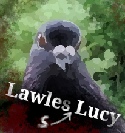

# FORage

FORage is a simple, pigeon-themed, postapocalyptic expedition management game written in Fortran.

## Progress

This is **very early work in progress** (not something I'd normally upload at this stage). I started this to try out the new [fortran package manager](https://github.com/fortran-lang/fpm) and [fortran standard library](https://github.com/fortran-lang/stdlib), but it looks like it'll turn into a little more.

Current progress and roadmap:  

| Feature               | Implemented |
| --------------------- | ----------- |
| RNG mechanics         | ✓           |
| Team skills           | ✓           |
| Expedition Activities | ✓           |
| Expedition Events     | ✓           |
| ANSI styled display   | ✓           |
| Terminal input        | ✓           |
| Morale mechanics      | -           |
| Survival mechanics    | -           |
| Saving/loading        | -           |
| Level maps            | -           |
| Story mode            | -           |
| Team selection        | -           |
| SDL2 display          | -           |
| SDL2 sound            | -           |
| SDL2 events & input   | -           |
| Artwork               | -           |
| Music                 | -           |

## Story

Climate change, pandemics, and global political instability lead to a series of worldwide conflicts that turned the whole planet into a postapocalyptic wasteland. Only the most resilient and adaptable survived ... that includes pigeons (and perhaps some Fortran code). You are one of the surviving pigeons of Scotland and feel responsible for creating a better life for your flock. Eventually, you see no other choice but to leave your beloved home, which had been anything but hospitable since the AMOC (Atlantic Meridional Overturning Circulation) shut down. You set out to reunite your fellow Scottish pigeons with your comrades on continental Europe. The journey will be long and dangerous, but you are ready to take the risk!

## Gameplay
- **Build a team**: All applicants for your pigeon-expedition have a unique set of skills and character traits. Choose a set of eager adventurers and make them your expedition members. You must gather your party before venturing FORth!
- **Lead your expedition**: Decide how you spend the day before making camp. Forage and scout to gain resources, explore points of interest, look after the health of your flock, and guard your camp to protect your members and resources from bandits (like magpies).
- **Survive**: Deal with accidents and diseases, prevent a mutiny, and defend your nest against intruders.

## Installation
FORage can be installed/compiled with the [fortran package manager (fpm)](https://github.com/fortran-lang/fpm).
